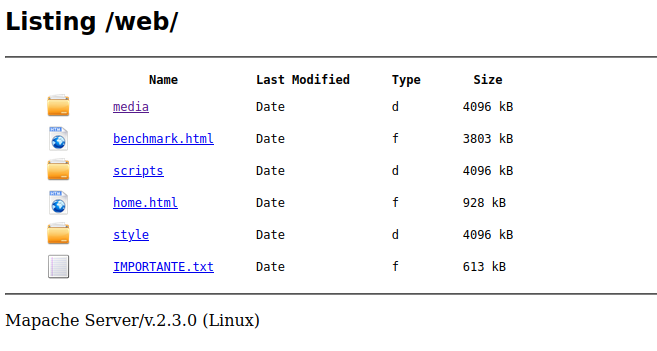

# Mapache Server

### *HTTP Serving, made simple*

<div style='text-align: center;' align='center'>
    
</div>

***

Visit the [official homepage](https://danibt656.github.io/website/mapache/)

Jump to the [Setup Page](doc/setup.md)

Jump to the [HTTPS config Page](doc/https.md)

## **Contents**

1. [Introduction](#1-what-is-it)

2. [Installation](#2-how-to-install-how-to-use-the-makefile)

	2.1. [Usage](#21-how-to-use-it)

	2.2. [Benchmarking](#22-how-to-check-an-example)

	2.3. [Server configuration](#23-how-to-edit-the-server-config-file)

3. [FAQ](#3-frequently-asked-questions)

## 1. What is it?

Mapache is my take on building the most complete HTTP/HTTPS web server that I can, totally from scratch: no NodeJS, no Python, just pure C and memory leaks!

For the time being it is just a side hobby, just a very entertaining one: you see, I've come to realize that I tend to return to C programming every once in a while. It's simple, I know the syntax, and there's something to having to do everything by yourself that seems both intimidating and motivating to me. So Mapache fits right in this *cookiecutter*.

### *Here's a snapshot of <u>what it currently does</u>*

+ Basic functionality of the HTTP/HTTPS protocol.

+ Yes, it supports HTTPS via OpenSSL & TLS protocol! ([*How to set it up?*](doc/https.md))

+ Support for Python & PHP server-side scripting (via CGI, or *Common Gateway Interface*).

+ It generates pretty cool directory listings, like this one:

<div style='text-align: center;' align='center'>
    
</div>

### *And here's a list of <u>what it could get to do</u>*

+ Compatibility with Windows & the *WinSock* API

+ Full (or semi-full) implementation of the HTTP protocol, as defined by [RFC 2616](https://www.ietf.org/rfc/rfc2616.txt).

+ Support for service-activation, no running executables required.

+ Support for multiple server-side scripting languages.

## 2. How to install? How to use the Makefile?

> Just execute the ALL Makefile rule to generate the executable:

```
$ make all
```

To clean binary files & build directories, use:

```
$ make clean
```

If you have run `make all` and want to do `clean + all`:

```
$ make reset
```

And for Valgrind checking:

```
$ make val
```

**IMPORTANT DEPENDENCIES**: you'll need to have Python3 and PHP installed in the host environment where the server will run, in order to support server-side scripting:

```
$ sudo apt install python3 php
```

### 2.1. How to use it?

Through compiling, a server executable will be generated. You can then run it with:

```
$ ./mapacheServer
```

This will init Mapache on localhost IP, and log messages will be shown in the terminal.

Nevertheless, there are also a couple of handy flags. You can check them with `-h`:

```
$ ./mapacheServer -h
USAGE: ./server <FLAGS>

Current <FLAGS> are:
   -h: Shows this help
   -d: Daemonizes server
   -s: Use OpenSSL-TLS to enable secure-HTTP (HTTPS) serving
   -f <FILE>: Redirect server logs to <FILE>
   -C <C_FILE>: Take configuration from <C_FILE> config file (default is `./mapache.conf`)
```

For detailed set-up documentation, please refer to the [Setting-Up page](doc/setup.md).

### 2.2. How to check an example?

This repo contains a [`web/`](https://github.com/danibt656/Mapache/tree/main/web) folder with both the Mapache start page (for checking if it is running) and a Benchmarking page. To see the main page, just start the server and navigate to this URL in your browser:

`http://localhost:8080/home.html`

The benchmarking page contains several items that display the current capabilities of Mapache, along with a loading chronometer. It is hosted at:

`http://localhost:8080/benchmark.html`

### 2.3 How to edit the server config file?

There is a server config file, called `server_conf.conf`, which allows you to edit:

+ The server name (`server_signature` label)

+ The root folder on which Mapache will search for your webpage files (`server_root` label)

+ The port in which to listen for clients (`listen_port` label)

+ Max number of clients to be connected at once (`max_clients` label)

Feel free to adjust these values to your needs.


## 3. Frequently Asked Questions

### *What's with the name 'Mapache'?*
Remember good old <a href="https://httpd.apache.org/" target="_blank">Apache Server</a>? Well, I think that pretty much answers your question :^)

### *Can I contribute to it?*
Yes! This project is licensed with the MIT License, so as far as I'm concerned, it's totally ok for you to create a pull request. I will validate your code and, if all goes okay, you will become an oficial Racoon Contributor.

<i>Thanks for checking this project out!</i>
